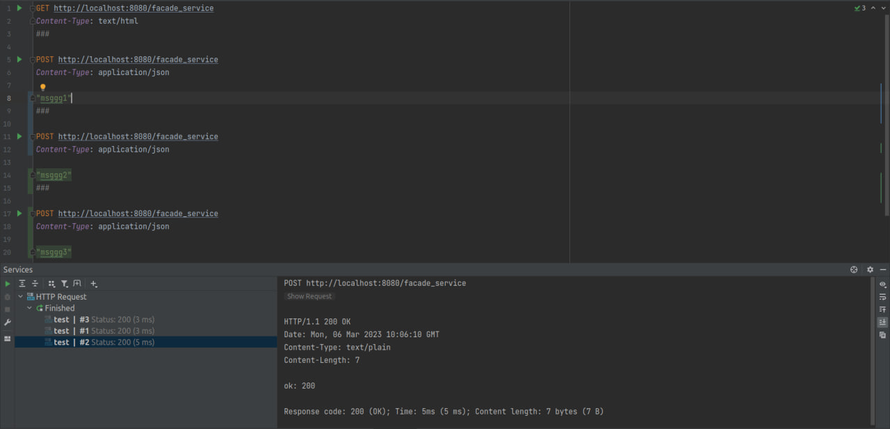
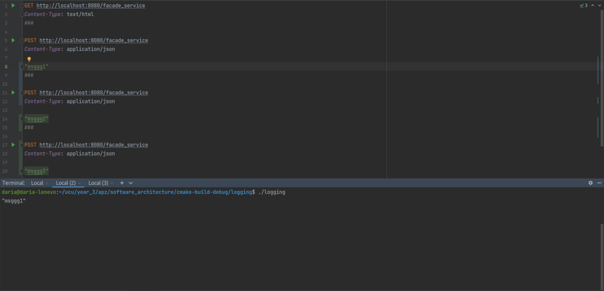
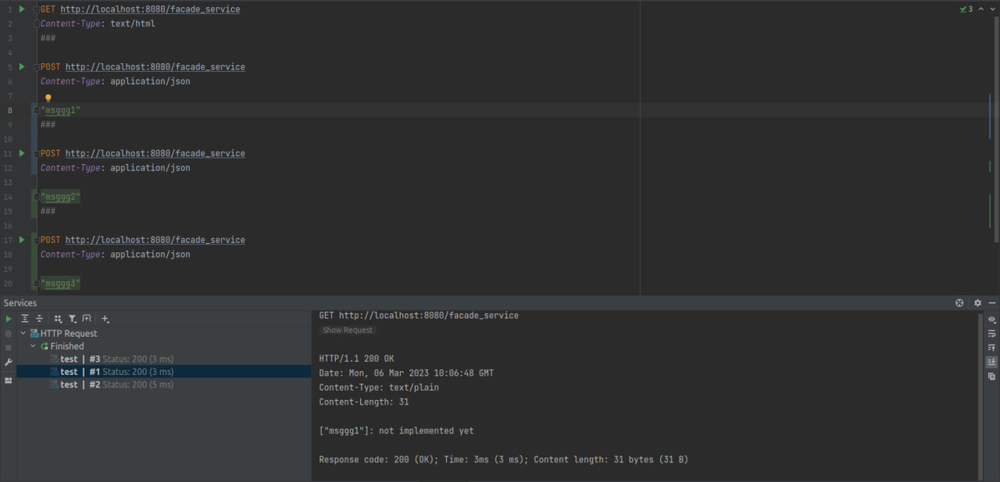
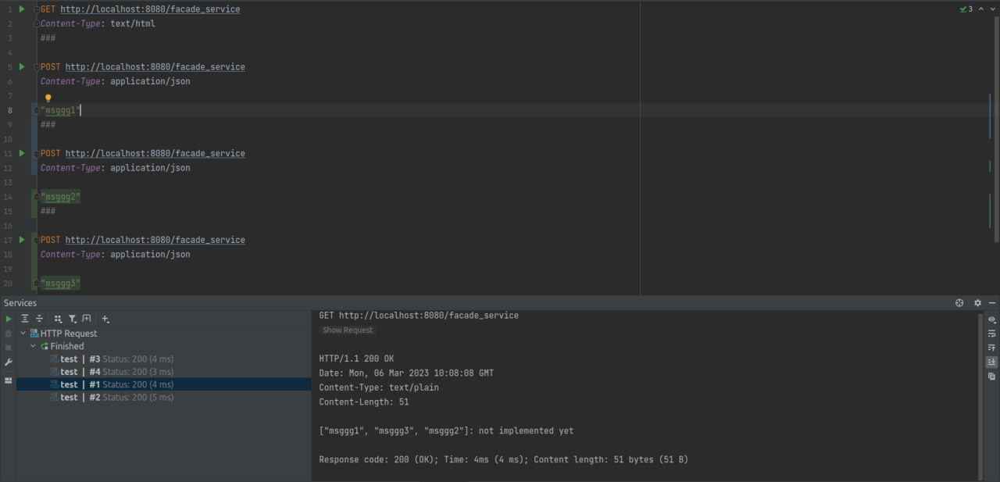
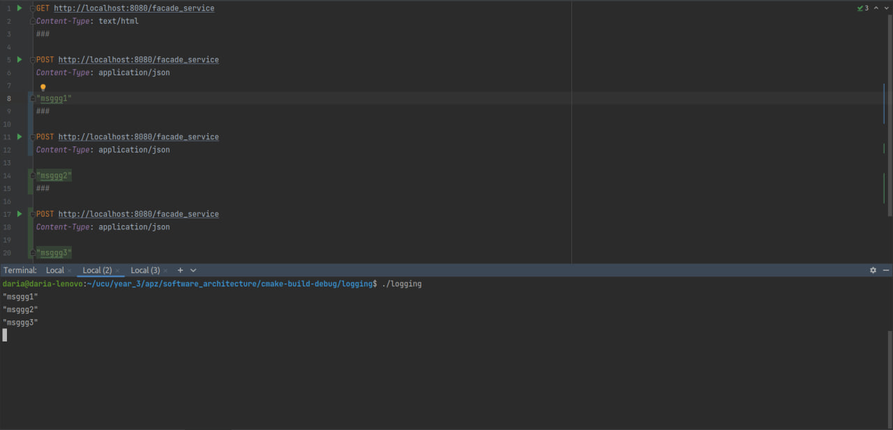

### software_architecture
# Lab 1 Daria Minieieva
## POST/GET requests screenshots

Here is example of running POST request with text "msggg1".  

And here is example of output to the "logging" console.  

Example of GET request that returns message from "logging" service and "not implemented yet" from "messages" service.  

And here is result of GET request after two more POST request with messages "msggg2" and "msggg3".  

And output of "logging" console.  

## Libraries

This lab is done on C++ using httpserver (https://github.com/etr/libhttpserver) for http server, cpr (https://github.com/libcpr/cpr) and Boost UUID for UUID generation. Also tbb concurrent hash map is used to store data in logging service.
