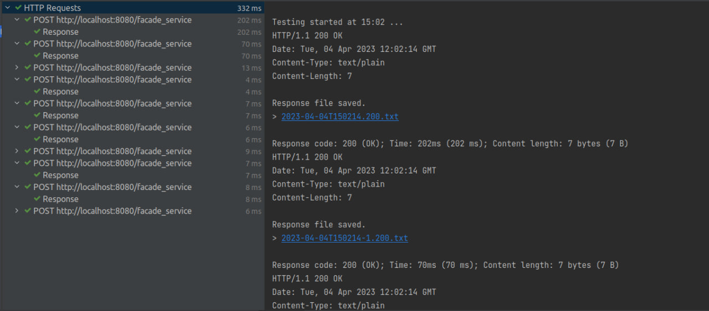

### software_architecture
# Lab 3 Minieieva

GitHub link:

In this task we have 3 instances of logging service and 3 Hazelcast nodes.

First I made 10 POST requests to facade service that will randomly choose one of three logging services. As we can see requests were successful.



This is the result of the GET request. All the messages are returned.


After terminating 2 logging services and 2 hazelcast nodes still all messages are returned.


However, if facade randomly chooses terminated logging service, no messages will be returned.


## Usage

To make usage of logging service easier, the port should be passed to it.

So to start logging services you should do the following:

```bash
./logging 8082
./logging 8083
./logging 8084
```

Right now these ports are hardcoded.