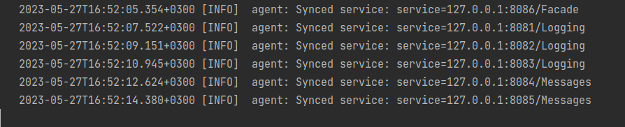

### software_architecture
# Lab 5 Minieieva

GitHub link: https://github.com/DariaMinieieva/software_architecture/tree/micro_consul

This laboratory uses consul to manage addresses and configs.

Here is the consul output that shows that all services connected to it



To test this laboratory I sent 10 messages as in previous labs.
There are 1 facade, 3 logging services and 2 messaging services.

Here are examples of responces for POST requests:


Here are outputs of logging services:


Here are the outputs of messages services:


And two possible results from GET request to facade service:


## Usage

This is how services should be started. The ports can be any value.

```bash
./logging 8080
./messages 8081
./facade 8082
```

To start a consul you can use the following command:

```bash
consul agent -server -data-dir=/tmp/consul -bootstrap-expect=1
```

And to deregister consul services you can do the following:

```bash
consul services deregister -id=127.0.0.1:8086/Facade
```
You should specify the name and port to the service.