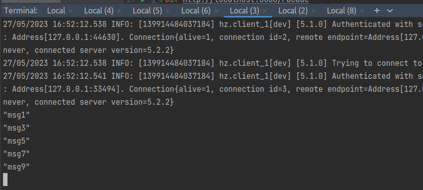

### software_architecture
# Lab 2 Daria Minieieva
GitHub link: [https://github.com/DariaMinieieva/software_architecture/tree/hazelcast_basics](https://github.com/DariaMinieieva/software_architecture/tree/hazelcast_basics)

### Task 1

In the first task we put 1000 values in a map.

As we can see, values almost evenly divided among nodes, however there is data loss due to data race.

After one node is disabled the data is still there and divides between two remaining nodes.

If only one node remains it has all the values.

### Task 2

Here we count values using map. Here is the result of the program without locks:

As there are three clients the value should be 3000, so here we see data loss due to data race.

The results for pessimistic and optimistic locks are both 3000 as there are no more data race.

### Task 3

In this tasks there a queue and clients that read and write to it.

The queue is bounded and has a capacity of 10 elements. So if it puts it there and there is no clients to read, it fills it up and waits until values are taken.

If there are a writer and two readers, writer can put all desired values and all of them are extracted by readers until they receive a poison pill.